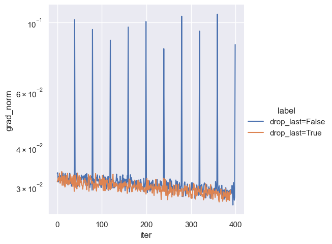

# PyTorch Pitfalls


## PyTorch

### 1. Use torch.gather for batch indexing
```
# ❌ BAD: Makes many independent calls to PyTorch's C++ backend (slow)
torch.cat([mat[:, t] for t in range(T)], dim=-1)  # Shape: (B, T)

# ✅ GOOD: Single optimized operation (fast)
torch.gather(mat, T.unsqueeze(0).repeat(B, 1), dim=-1)  # Shape: (B, T)
```

### 2. PyTorch indexing makes copies leading to OOM
```
# ❌ BAD: Creates a copy
b = a[mask] // mask is a bool tensor with true for first 10 positions

# ✅ GOOD: Creates a view
b = a[0:10]
```

### 3. Views can cause OOM during backward
```
# ❌ BAD: Creates a copy
b = a.expand(10)  // efficient view during forward but not backward
loss = f(b)
loss.backward()

# ✅ GOOD: Creates a view
for i in range(10)
    loss_i = f(b)
    loss.backward()
```

### 4. MoE memory usage during backward
```python
# ❌ BAD: Entire tensor and its grad materialized
w = nn.Parameter(nn.randn(n_experts, d_hidden))
w_mix = w[mask]

# ✅ GOOD: Separate tensors, no grads materialized for inactive tensors
for i in range(n_experts):
    setattr(self,  f"w_encoder_{i}", nn.Parmeter(nn.randn(d_hidden)))
w_mix = torch.stack([getattr(self, f"w_{i}")])
```


### 5. Avoid gradient peaks during training



```python
# ❌ BAD: Last batch may cause peak in grad norm
dataloader = torch.utils.data.DataLoader(dataset, batch_size=batch_size, shuffle=True)

# ✅ GOOD: All batches same size
dataloader = torch.utils.data.DataLoader(dataset, batch_size=batch_size, shuffle=True, drop_last=True)
```


## Python

### 1. Loops and Lambda functions don't play well

```
# ❌ BAD: All lambdas capture final loop values
funcs_list = [
    lambda a, b: a/b
    for (a, b) in zip ([1, 1, 1], [2, 4, 8])
]
print([f() for f in funcs_list])
>>> [1/8, 1/8, 1/8]  # wrong

# ✅ GOOD: Immediate binding via default arguments
def create_fn(a, b):
    return lambda a, b: a/b

funcs_list = [ 
    create_fn(a, b)
    for (a, b) in zip ([1, 1, 1], [2, 4, 8])
]
print([f() for f in funcs_list])
>>> [1/2, 1/4, 1/8] # correct
```


